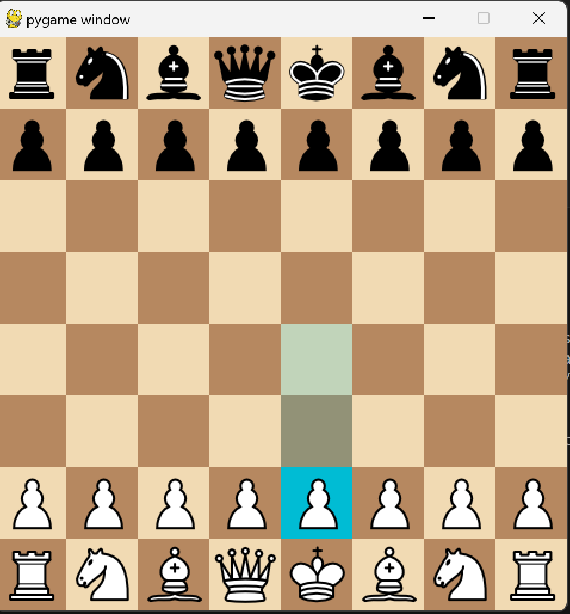
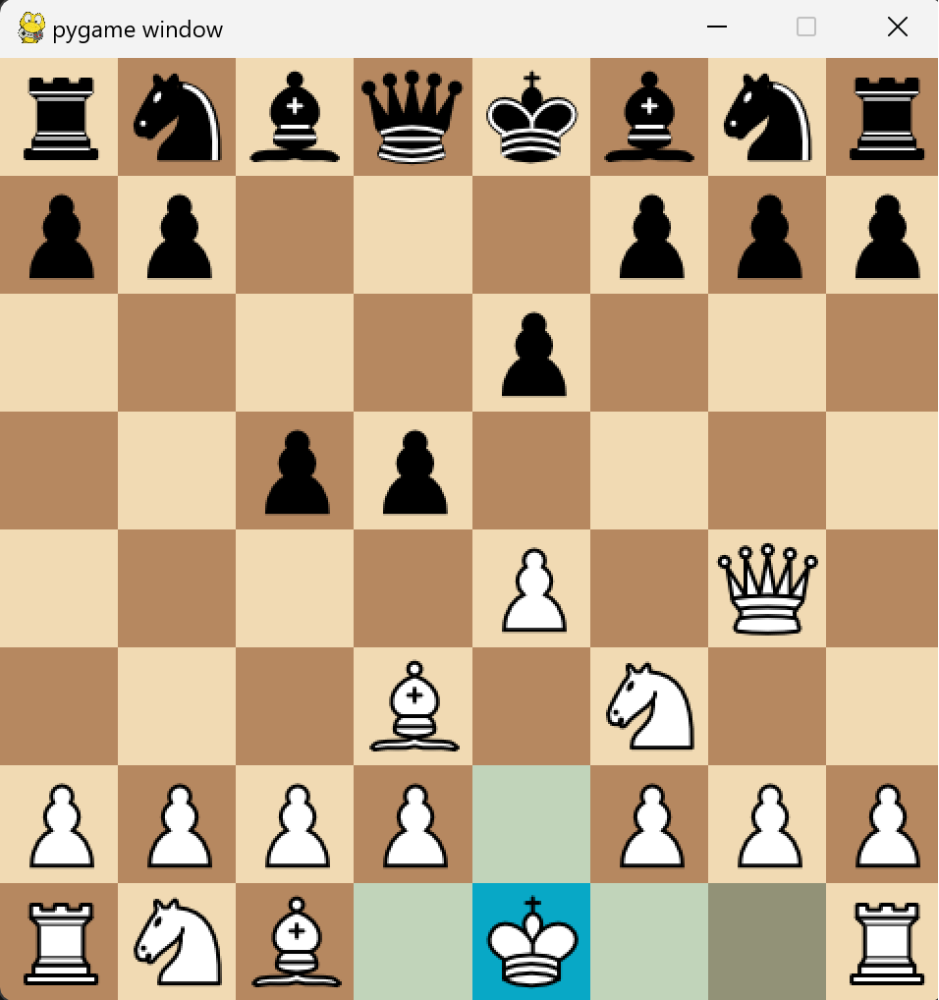

# Chess Game with Pygame

This is a simple chess game implemented in Python using the Pygame library. I created this project in 2021 as a learning exercise to explore Pygame and enhance my Python programming skills.

## Features

- Classic chess gameplay with a graphical user interface.
- Player vs. Player mode for two human players.
- Basic chess rules implemented, including check and checkmate detection.
- Visual representation of valid moves when a piece is selected.

## Requirements

Make sure you have Python and Pygame installed:

```bash
pip install pygame
```

## How to Play

1. Clone this repository:

```
git clone https://github.com/VarunAgarwalOfficial/Chess
```


2. Navigate to the project directory:

```bash
cd chess-pygame
```


3. Run the game:

```bash
python __init__.py
```


4. Enjoy playing chess!

## Controls

- Click on a piece to select it.
- Click on a highlighted square to move the selected piece.

## Screenshots





## Acknowledgements

This project was inspired by my desire to learn Pygame and improve my Python programming skills. Special thanks to the Pygame community for their valuable resources and tutorials.

Feel free to explore, modify, and share this code. Happy coding!
